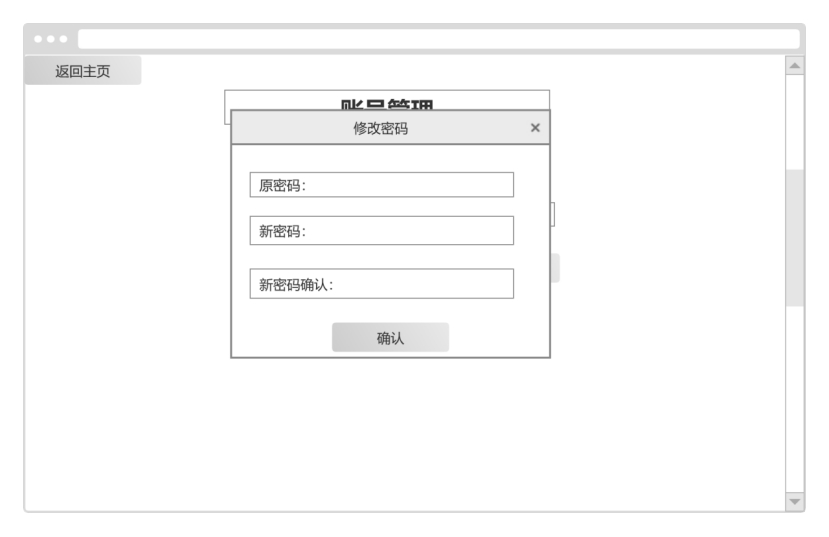

# owner_pro——招募系统

---

**1.** ***\*概要\****

**1.1** ***\*项目简介\****

博远招募系统是一款用于应对校内外各种招募活动，主要向社团成员开放的招募平台。招募系统中支持社团成员注册个人账号并根据需求发表和管理招募帖子。

**1.2** ***\*业务目标\****

（1）允许社团成员以及招募者可以在论坛上发布信息并且管理。

（2）总容纳人数2000人，允许200人同时在线。

**1.3** ***\*业务范围\****

（1）满足招募人员投放招募帖子的平台需求

（2）满足社团成员公开可见招募信息并可自主联系交流的需求

**1.4** ***\*使用人群\****

（1）管理员

（2）用户

**2.** ***\*功能\****

平台内容可以分成三个主要内容：

（1）门户主页

（2）招募帖子管理系统

（3）个人信息管理系统

三个主要内容板块所对应的功能详细说明将在表 1 门户主页功能板块、表 2 招募帖子页面及相关管理系统功能板块、表 3 个人信息管理系统功能板块分别呈现。

表 1.	门户主页功能板块

| **功能板块** | **功能名称**                                                 | **详细内容**                                                 |
| ------------ | ------------------------------------------------------------ | ------------------------------------------------------------ |
| **门户主页** | 页眉的说明文字                                               | 静态，博远信息技术社。实现主页和个人中心的跳转               |
|              | 筛选选项卡                                                   | 通过技术栈、需求方向、招募任务类型筛选招募帖子               |
|              | 主体区                                                       | 按时间倒序，置顶情况，完成状态展示招募帖子，点击详细信息可查看招募帖子的具体信息 |
| **登录注册** | 登录                                                         | 通过密码登录平台。登录成功后跳转到招募帖子展示首页。         |
| 注册         | 提交用户名、密码、姓名、学号等内容注册，注册成功后跳转到登录界面 |                                                              |

表2. 招募帖子管理系统功能板块

| **功能板块** | **功能名称** | **详细内容**                                                 |
| ------------ | ------------ | ------------------------------------------------------------ |
| **招募组队** | 发布招募     | 点击发布帖子按钮，跳转到发布页面                             |
|              | 招募要求选择 | 依次选择项目的任务类型（如双创、商业项目）、需求方向（如前端、后端）、技术栈（如语言要求、框架要求） |
|              | 项目时间要求 | 依次填入项目开始时间（模糊时间即可）、项目结束时间（模糊时间即可） |
|              | 联系方式公布 | 发布者留下联系方式（注明WX/QQ/TEL）                          |
|              | 详细要求描述 | 允许发布者输入具体的项目相关内容                             |

表3. 个人信息管理系统功能板块

| **功能板块** | **功能名称**     | **详细内容**                                                 |
| ------------ | ---------------- | ------------------------------------------------------------ |
| **进入链接** | 导航栏跳转       | 通过导航栏链接进入个人中心                                   |
| **个人中心** | 信息更改         | 可更改用户名、头像等相关信息                                 |
|              | 重置密码         | 用户填写旧密码与新密码，验证成功后可重置用户密码             |
|              | 创作中心         | 按时间倒序，置顶情况，完成状态展示该用户发布招募帖子，点击详细信息可查看招募帖子的具体信息。 |
|              | 发布招募         | 点击发布帖子按钮，跳转到发布页面                             |
|              | 更新个人招募帖子 | 通过点击更新按钮来更新帖子的详细内容                         |
|              | 删除个人招募帖子 | 通过点击删除按钮来删除该帖子                                 |
|              | 设置完成状态     | 通过点击已完成按钮来设置帖子为完成状态                       |
|              | 设置未完成状态   | 通过点击未完成按钮来设置帖子为未完成状态                     |
| **账号管理** | 退出登录         | 点击后可退出目前账号并重新触发登录弹窗                       |
|              | 删除用户         | 点击后可将本用户删除                                         |

***\*4.权限管理\****

权限管理表明确了对本文档第 2 部分所有功能和涉及的实体的控制权限，只有拥有权限的系统用户才有可能接触到相关信息。 

平台内容可以分成三个主要内容：（1）门户主页（2）招募帖子管理系统（3）个人信息管理系统。涉及人员有社团成员、管理员。 

他们具体的权限分配按照三个主要内容分别在表 4(1)门户主页权限管理表、表 4(2)招募帖子管理系统权限管理表、表 4(3)个人信息管理系统权限管理表中呈现。

表4（1）门户主页权限管理表

| 相关人员 | 登录 | 注册 | 浏览帖子 | 删除帖子 | 置顶帖子 |
| -------- | ---- | ---- | -------- | -------- | -------- |
| 用户     | √    | √    | √        | ×        | ×        |
| 管理员   | √    | ×    | √        | √        | √        |

表4（2）招募帖子管理系统权限管理表

| 相关人员 | 发布帖子 |
| -------- | -------- |
| 用户     | √        |
| 管理员   | √        |

表4（3）个人信息管理系统权限管理表

| 相关人员 | 更改个人信息 | 修改密码 | 管理自己发布的帖子 | 置顶自己发布的帖子 |
| -------- | ------------ | -------- | ------------------ | ------------------ |
| 用户     | √            | √        | √                  | ×                  |
| 管理员   | ×            | ×        | √                  | √                  |

**5.** ***\*原型设计\****

***\*5.1门户主页\****

***\*5.1.1登录界面\****

 

***\*5.1.2 注册\****

***\*5.1.3 门户主页\****

 

***\*5.2 个人中心\****

 

***\*5.2.1 点击修改密码\****

 

***\*5.3 发布帖子\****

 

**接口文档**

***\*接口统一返回数据形式\****

| 返回字段 | 字段类型 | 说明                                         |
| -------- | -------- | -------------------------------------------- |
| code     | int      | 返回结果状态 0：正常；其他见接口错误码中定义 |
| message  | String   | 错误码对应说明                               |
| result   | 0bject   | 数据内容                                     |

***\*接口错误码\****

| 错误码 | 说明                     |
| ------ | ------------------------ |
| 0      | 调用成功                 |
| 1      | 登录状态失效，请重新登录 |
| -2     | 参数格式不正确           |
| 1000   | 网络不给力，请稍后重试   |
| 1001   | 密码错误                 |
| 1002   | 用户不存在               |
| 1003   | 用户名已存在             |
| 1004   | 该管理员已存在           |
| 1005   | 参数长度不正确           |
| 1006   | 邮箱格式不正确           |
| 1007   | 帖子不存在               |
| 1008   | 无相关权限               |
| 1009   | 认证失败                 |
| 1010   | 管理员不存在             |
| 1011   | 学号已被使用             |
| 1012   | 没有帖子                 |
| 1013   | 文件格式错误             |
| 1014   | 文件为空                 |
| 1015   | 更新失败                 |
| 1016   | 实体为空                 |
| 1017   | 登录失败                 |
| 1018   | 未获取到session          |
| 1019   | 新密码与旧密码重复       |

***\*用户相关API\****

1. 登录接口

接口地址     /login

请求方式     POST

参数类型     JSON

请求参数

| 参数     | 必选 | 类型   | 说明             |
| -------- | ---- | ------ | ---------------- |
| username | true | String | 用户名(长度2-20) |
| password | true | String | 密码(长度6-20)   |

2. 注册接口

接口地址     /signup

请求方式     POST

参数类型     JSON

请求参数

| 参数        | 必选 | 类型   | 说明             |
| ----------- | ---- | ------ | ---------------- |
| username    | true | String | 用户名(长度2-20) |
| password    | true | String | 密码(长度6-20)   |
| studentid   | true | String | 学号             |
| studentname | true | String | 姓名             |

3. 注销接口

接口地址    /logout

请求方式：    GET

请求参数：    无

4. 删除用户接口

接口地址：  /deleteUserById

请求方式：		GET

请求参数：		无

5. 用户个人信息及帖子管理

接口地址：		/userInfo

请求方式：		GET

参数类型    JSON

请求参数

| 参数     | 必选 | 类型    | 说明                  |
| -------- | ---- | ------- | --------------------- |
| pageSize | true | Integer | 每页显示数量(不小于0) |
| pageNum  | true | Integer | 页数(不小于0)         |

6. 管理员个人信息及帖子管理

接口地址：		/adminInfo

请求方式：		GET

参数类型    JSON

请求参数

| 参数     | 必选 | 类型    | 说明                  |
| -------- | ---- | ------- | --------------------- |
| pageSize | true | Integer | 每页显示数量(不小于0) |
| pageNum  | true | Integer | 页数(不小于0)         |

7. 更新用户信息

接口地址     /update

请求方式     POST

参数类型     JSON

请求参数

| 参数     | 必选  | 类型   | 说明             |
| -------- | ----- | ------ | ---------------- |
| username | true  | String | 用户名(长度2-20) |
| birthday | false | Date   | 生日(可选)       |
| email    | false | String | 邮箱(可选)       |

8. 更新用户头像

接口地址     /portrait

请求方式     POST

参数类型     JSON

请求参数

| 参数         | 必选  | 类型          | 说明 |
| ------------ | ----- | ------------- | ---- |
| headportrait | false | MultipartFile | 头像 |

9. 更新用户密码

接口地址     /updatePassword

请求方式     POST

参数类型     JSON

请求参数

| 参数        | 必选 | 类型   | 说明           |
| ----------- | ---- | ------ | -------------- |
| oldPassword | true | String | 密码(长度6-20) |
| newPassword | true | String | 密码(长度6-20) |

***\*招募帖子\**\*相关API\****

1. 发布招募帖子

接口地址     /createArticle

请求方式     POST

参数类型     JSON

请求参数

| 参数        | 必选 | 类型         | 说明         |
| ----------- | ---- | ------------ | ------------ |
| update_date | true | Date         | 发布日期     |
| type        | true | List<String> | 招募任务类型 |
| direction   | true | List<String> | 需求方向     |
| tag         | true | List<String> | 技术栈       |
| content     | true | String       | 详细内容     |
| start_time  | true | String       | 任务开始时间 |
| end_time    | true | String       | 任务结束时间 |
| contact     | true | String       | 联系方式     |

2. 展示招募帖子

接口地址     /article

请求方式     GET

参数类型     JSON

请求参数

| 参数      | 必选  | 类型         | 说明                           |
| --------- | ----- | ------------ | ------------------------------ |
| type      | false | List<String> | 招募任务类型                   |
| direction | false | List<String> | 需求方向                       |
| tag       | false | List<String> | 技术栈                         |
| finish    | false | Integer      | 是否完成(0为未完成，1为已完成) |
| pageSize  | true  | Integer      | 每页显示数量(不小于0)          |
| pageNum   | true  | Integer      | 页数(不小于0)                  |

3. 显示招募帖子详情

接口地址     /articleDetail/{article_id}

请求方式     GET 

参数类型     JSON

请求参数

| 参数       | 必选 | 类型    | 说明   |
| ---------- | ---- | ------- | ------ |
| article_id | true | Integer | 帖子id |

4. 更新招募帖子

接口地址     /updateArticle

请求方式     POST

参数类型     JSON

请求参数

| 参数        | 必选  | 类型         | 说明                           |
| ----------- | ----- | ------------ | ------------------------------ |
| article_id  | true  | Integer      | 帖子id                         |
| update_date | true  | Date         | 发布日期                       |
| type        | true  | List<String> | 招募任务类型                   |
| direction   | true  | List<String> | 需求方向                       |
| tag         | true  | List<String> | 技术栈                         |
| content     | true  | String       | 详细内容                       |
| start_time  | true  | String       | 任务开始时间                   |
| end_time    | true  | String       | 任务结束时间                   |
| contact     | true  | String       | 联系方式                       |
| finish      | false | Integer      | 是否完成(0为未完成，1为已完成) |

5. 删除招募帖子

接口地址     /deleteArticle/{article_id}

请求方式     GET

参数类型     JSON

请求参数

| 参数       | 必选 | 类型    | 说明   |
| ---------- | ---- | ------- | ------ |
| article_id | true | Integer | 帖子id |

6. 招募帖子设置完成状态

接口地址     /finishArticle/{article_id}

请求方式     GET 

参数类型     JSON

请求参数

| 参数       | 必选 | 类型    | 说明   |
| ---------- | ---- | ------- | ------ |
| article_id | true | Integer | 帖子id |

7. 招募帖子设置未成状态

接口地址     /unfinishArticle/{article_id}

请求方式     GET

参数类型     JSON

请求参数

| 参数       | 必选 | 类型    | 说明   |
| ---------- | ---- | ------- | ------ |
| article_id | true | Integer | 帖子id |

8. 置顶帖子

接口地址     /topArticle/{article_id}

请求方式     GET

参数类型     JSON

请求参数

| 参数       | 必选 | 类型    | 说明   |
| ---------- | ---- | ------- | ------ |
| article_id | true | Integer | 帖子id |

9. 取消置顶帖子

接口地址     /untopArticle/{article_id}

请求方式     GET

参数类型     JSON

请求参数

| 参数       | 必选 | 类型    | 说明   |
| ---------- | ---- | ------- | ------ |
| article_id | true | Integer | 帖子id |

| 参数        | 必须 | 类型         | 说明                 |
| ----------- | ---- | ------------ | -------------------- |
| article_id  | true | Integer      | 文章编号             |
| id          | true | Integer      | 发帖人编号           |
| update_date | true | Date         | 发布日期             |
| type        | true | List<String> | 招募任务类型         |
| direction   | true | List<String> | 需求方向             |
| tag         | true | List<String> | 技术栈               |
| content     | true | String       | 详细内容             |
| start_time  | true | String       | 大致开始时间         |
| end_time    | true | String       | 大致结束时间         |
| contact     | true | String       | 联系方式             |
| finish      | true | Integer      | 0为未完成，1为已完成 |
| top         | true | Integer      | 0为未置顶，1未置顶   |
